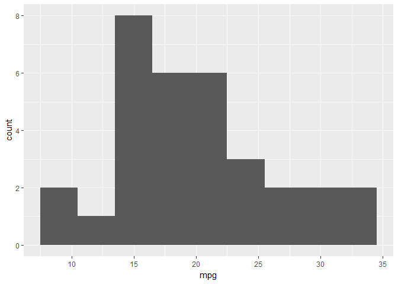
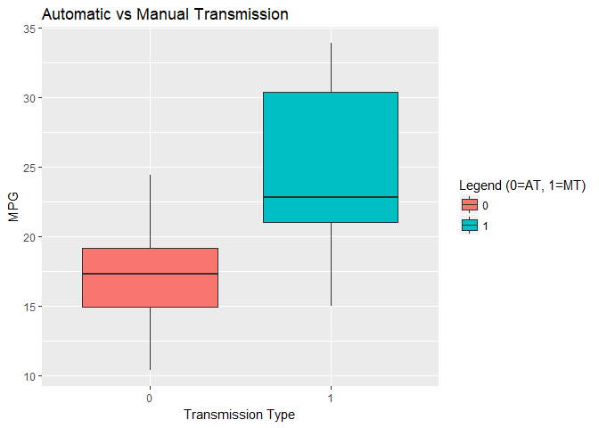
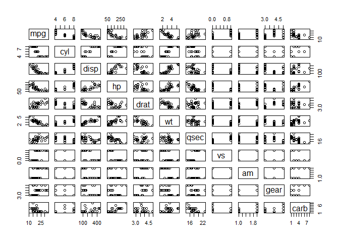
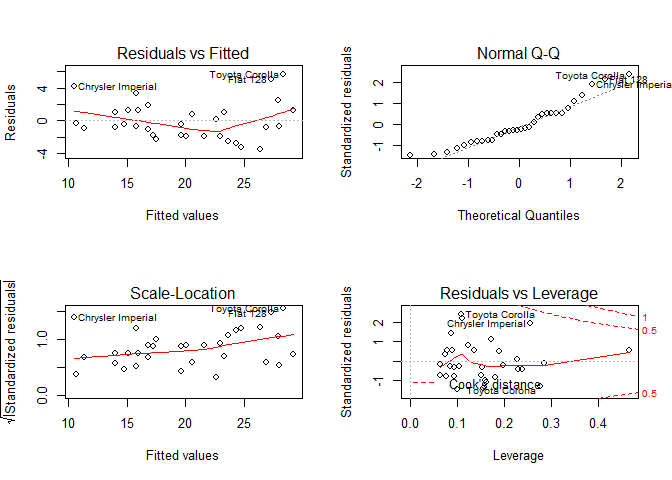

Executive Summary
=================

You work for Motor Trend, a magazine about the automobile industry.
Looking at a data set of a collection of cars, they are interested in
exploring the relationship between a set of variables and miles per
gallon (MPG) (outcome). They are particularly interested in the
following two questions:

**Question 1:** “Is an automatic or manual transmission better for MPG”

**Question 2:** "Quantify the MPG difference between automatic and
manual transmissions"

After analyzing the data, we arrive to the following conclusions:

**Answer 1:** Manual transmissions perform better than automatic
transmissions by 7.25MPG, however this single factor only accounts for
36% of the explanation

**Answer 2:** When measuring MPG, manual transmissions provide an
additional 1.48MPG of performance over automatic transmissions when
taking into account three additonal explanatory variables (cylinders,
horsepower & weight), these additional factors account for 85% of the
explanation

Exploratory Data Analysis
=========================

### Loading the data and observing the data set:

    library(datasets)
    data(mtcars)

    head(mtcars, 3)

    ##                mpg cyl disp  hp drat    wt  qsec vs am gear carb
    ## Mazda RX4     21.0   6  160 110 3.90 2.620 16.46  0  1    4    4
    ## Mazda RX4 Wag 21.0   6  160 110 3.90 2.875 17.02  0  1    4    4
    ## Datsun 710    22.8   4  108  93 3.85 2.320 18.61  1  1    4    1

    str(mtcars)

    ## 'data.frame':    32 obs. of  11 variables:
    ##  $ mpg : num  21 21 22.8 21.4 18.7 18.1 14.3 24.4 22.8 19.2 ...
    ##  $ cyl : num  6 6 4 6 8 6 8 4 4 6 ...
    ##  $ disp: num  160 160 108 258 360 ...
    ##  $ hp  : num  110 110 93 110 175 105 245 62 95 123 ...
    ##  $ drat: num  3.9 3.9 3.85 3.08 3.15 2.76 3.21 3.69 3.92 3.92 ...
    ##  $ wt  : num  2.62 2.88 2.32 3.21 3.44 ...
    ##  $ qsec: num  16.5 17 18.6 19.4 17 ...
    ##  $ vs  : num  0 0 1 1 0 1 0 1 1 1 ...
    ##  $ am  : num  1 1 1 0 0 0 0 0 0 0 ...
    ##  $ gear: num  4 4 4 3 3 3 3 4 4 4 ...
    ##  $ carb: num  4 4 1 1 2 1 4 2 2 4 ...

### Further exploration of the data set

    summary(mtcars$mpg)

    ##    Min. 1st Qu.  Median    Mean 3rd Qu.    Max. 
    ##   10.40   15.43   19.20   20.09   22.80   33.90

We see that the median and the mean of mpg are close to each other,
suggesting a normal distribution. Plotting the data will give a better
view on the data.

    library(ggplot2)
    ggplot(data = mtcars, aes(x = mpg))+geom_histogram(binwidth = 3)

This graph suggests that the data for mpg is slightly rightly skewed.

We would also like to see how mpg changes when controlled for autmatic
transmission versus manual transmission. Boxplots are a good way to show
the relationships between numerical and categorical variables

    #Visualization ~ Automatic vs Manual Transmission:
    library(ggplot2)
    mtcars$am <- as.factor(mtcars$am)
    Trans_Type <- ggplot(aes(x=am, y=mpg), data=mtcars) + geom_boxplot(aes(fill=am))
    Trans_Type <- Trans_Type + labs(title = "Automatic vs Manual Transmission")
    Trans_Type <- Trans_Type + xlab("Transmission Type")
    Trans_Type <- Trans_Type + ylab("MPG")
    Trans_Type <- Trans_Type + labs(fill = "Legend (0=AT, 1=MT)")
    Trans_Type

This boxplot is a first indication of the drivers behind mpg. We clearly
see that automatic transmissions are consume on average less than manual
transmissions.

Lets review the summary statistics but this time split between the two
groups.

    Trans_Stats = split(mtcars$mpg, mtcars$am)

The mean:

    sapply(Trans_Stats, mean)

    ##        0        1 
    ## 17.14737 24.39231

The standard deviation:

    sapply(Trans_Stats, sd)

    ##        0        1 
    ## 3.833966 6.166504

The maximum and the minimum

    sapply(Trans_Stats, range)

    ##         0    1
    ## [1,] 10.4 15.0
    ## [2,] 24.4 33.9

Looking at the summary statistics

Hypothesis testing
==================

We would like to formally test wether there is a significant difference
between automatic and manual transmissions in terms of mpg. In order to
do this the following t-test has been executed:

    Auto_trans <- mtcars[mtcars$am == "0",]
    Man_trans <- mtcars[mtcars$am == "1",]
    t.test(Auto_trans$mpg, Man_trans$mpg)

    ## 
    ##  Welch Two Sample t-test
    ## 
    ## data:  Auto_trans$mpg and Man_trans$mpg
    ## t = -3.7671, df = 18.332, p-value = 0.001374
    ## alternative hypothesis: true difference in means is not equal to 0
    ## 95 percent confidence interval:
    ##  -11.280194  -3.209684
    ## sample estimates:
    ## mean of x mean of y 
    ##  17.14737  24.39231

P-value being smaller than 5% we can safely conclude that there is a
signficant difference between manual transmissions and automatic
transmissions. Automatic transmissions consume significantly less than
manual transmissions. Now we would like to exactly measure this
difference through linear regressions.

Linear Regression Model
=======================

### Single regressor model

First, I conduct a regression with only the am variable:

    Model1 <- lm(mpg ~ am, data = mtcars)
    summary(Model1)

    ## 
    ## Call:
    ## lm(formula = mpg ~ am, data = mtcars)
    ## 
    ## Residuals:
    ##     Min      1Q  Median      3Q     Max 
    ## -9.3923 -3.0923 -0.2974  3.2439  9.5077 
    ## 
    ## Coefficients:
    ##             Estimate Std. Error t value Pr(>|t|)    
    ## (Intercept)   17.147      1.125  15.247 1.13e-15 ***
    ## am1            7.245      1.764   4.106 0.000285 ***
    ## ---
    ## Signif. codes:  0 '***' 0.001 '**' 0.01 '*' 0.05 '.' 0.1 ' ' 1
    ## 
    ## Residual standard error: 4.902 on 30 degrees of freedom
    ## Multiple R-squared:  0.3598, Adjusted R-squared:  0.3385 
    ## F-statistic: 16.86 on 1 and 30 DF,  p-value: 0.000285

**Interpreation**

Automatic transmission: the mean mpg consumed is equal to 17.147 mpg
Manual transmission: the mean mpg consumed is qual to 17.147 mpg + 7.245
mpg = 24.392 mpg. In other words manual tranmission consumed on average
7.245 mpg *more* than automatic transmission.

However, when we look at adjusted R² we see that the model only explains
33.85% of the variation in the observations. We can try to get a more
accurate and parsimonuous model by adding extra variables.

We find the same results (with a slightly different interpreation) when
exluding the intercept. Here we see the means when compared to 0.

    Model1.1 <- lm(mpg ~ am - 1, data = mtcars)
    summary(Model1.1)

    ## 
    ## Call:
    ## lm(formula = mpg ~ am - 1, data = mtcars)
    ## 
    ## Residuals:
    ##     Min      1Q  Median      3Q     Max 
    ## -9.3923 -3.0923 -0.2974  3.2439  9.5077 
    ## 
    ## Coefficients:
    ##     Estimate Std. Error t value Pr(>|t|)    
    ## am0   17.147      1.125   15.25 1.13e-15 ***
    ## am1   24.392      1.360   17.94  < 2e-16 ***
    ## ---
    ## Signif. codes:  0 '***' 0.001 '**' 0.01 '*' 0.05 '.' 0.1 ' ' 1
    ## 
    ## Residual standard error: 4.902 on 30 degrees of freedom
    ## Multiple R-squared:  0.9487, Adjusted R-squared:  0.9452 
    ## F-statistic: 277.2 on 2 and 30 DF,  p-value: < 2.2e-16

### Multivariate regressor model

This model looks at 4 additional regressors:

1.  Automatic versus manual transmission  
2.  Cylinder type  
3.  Horsepower  
4.  Weight

<!-- -->

    Model2 <- lm(mpg~am + cyl + hp + wt, data = mtcars)
    summary(Model2)

    ## 
    ## Call:
    ## lm(formula = mpg ~ am + cyl + hp + wt, data = mtcars)
    ## 
    ## Residuals:
    ##     Min      1Q  Median      3Q     Max 
    ## -3.4765 -1.8471 -0.5544  1.2758  5.6608 
    ## 
    ## Coefficients:
    ##             Estimate Std. Error t value Pr(>|t|)    
    ## (Intercept) 36.14654    3.10478  11.642 4.94e-12 ***
    ## am1          1.47805    1.44115   1.026   0.3142    
    ## cyl         -0.74516    0.58279  -1.279   0.2119    
    ## hp          -0.02495    0.01365  -1.828   0.0786 .  
    ## wt          -2.60648    0.91984  -2.834   0.0086 ** 
    ## ---
    ## Signif. codes:  0 '***' 0.001 '**' 0.01 '*' 0.05 '.' 0.1 ' ' 1
    ## 
    ## Residual standard error: 2.509 on 27 degrees of freedom
    ## Multiple R-squared:  0.849,  Adjusted R-squared:  0.8267 
    ## F-statistic: 37.96 on 4 and 27 DF,  p-value: 1.025e-10

**Interpretation**

F-statistic:  
The model as a whole is significant with a very high F-statistic and a
low p-value.

Individual P-values:  
We see that am1 is still highly significant with the intercept however
we the impact of having a automatic transmission on mpg is considerably
lower (from 7.245 in model 1 to 1.478 model 2).

Interesting result is weight. It appears that more weight decreases mpg
which might sound counter intuitive. Weight is also signficant

Model accuracy:  
Model 2 is more accurate in explaing the variance in observation with an
adjusted R² of 82.67% (as opposed to 33.85%).

We can make an additional anova test to se wether the models are
significantly different from each other. In other words, we test wether
adding the extra variables produces a different model.

    anova(Model1, Model2)

    ## Analysis of Variance Table
    ## 
    ## Model 1: mpg ~ am
    ## Model 2: mpg ~ am + cyl + hp + wt
    ##   Res.Df   RSS Df Sum of Sq      F    Pr(>F)    
    ## 1     30 720.9                                  
    ## 2     27 170.0  3     550.9 29.166 1.274e-08 ***
    ## ---
    ## Signif. codes:  0 '***' 0.001 '**' 0.01 '*' 0.05 '.' 0.1 ' ' 1

**Interpretation**

We reject the null hypothesis of the two models being equal.

Appendix
========

This plot helps to detect wether certain variables are correlated with
each other. Correlation between the regressors can bias the predictors.

    pairs(mpg ~ ., data = mtcars)

We see for instance that weight and horsepower show a positive
correlation.

This plot summarises the most important tests for a regression model: -
Linearity - Normal distribution

    par(mfrow = c(2,2))
    plot(Model2)

**Interpretation**

-   We see no real pattern in the residuals so the data is
    homoskedastic  
-   The plots follow more or less the line, suggesting the model is
    linear but skewed to the right  
-   Some outliers have influence and leverage such as the Toyota Corolla
